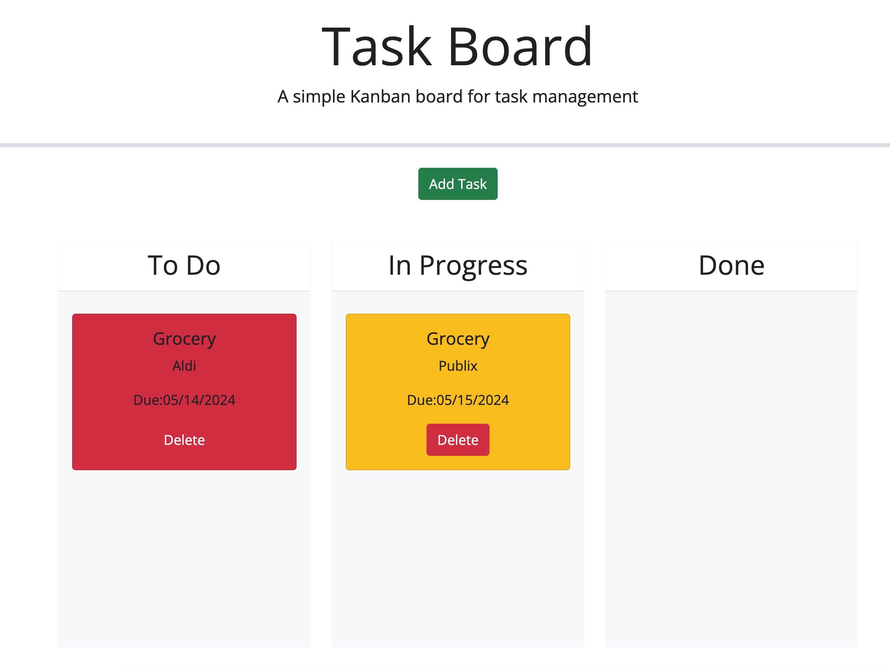

# task-board

## Discription

The purspose of this project is to create task cards by adding the task title, due date and description.  Once created, the can be dragged from the To Do lane to the In Progress or completed lanes.

* Add Task button should open up a modal requesting user to input the tak title, due date and description.
* The task cards created should be able to be dragged to the In Progress and Done lanes.
* The task cards should be able to change colors from red if task is past due and yellow if the due date is today to white once placed in the Done lane.

## Installation

Website:

## Contact Information

Jorge Guzman
jguzman913@gmail.com